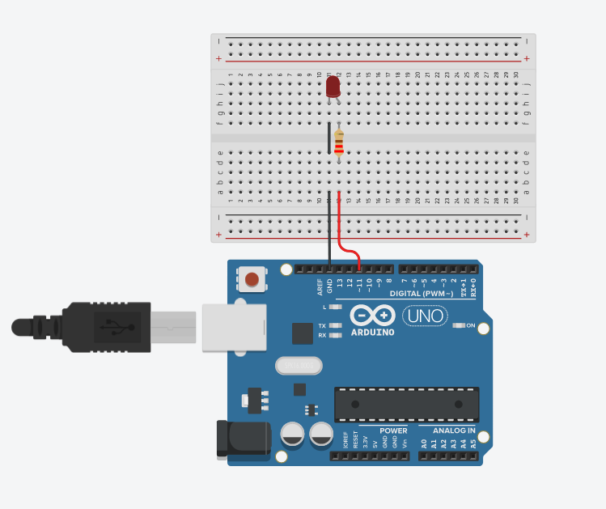
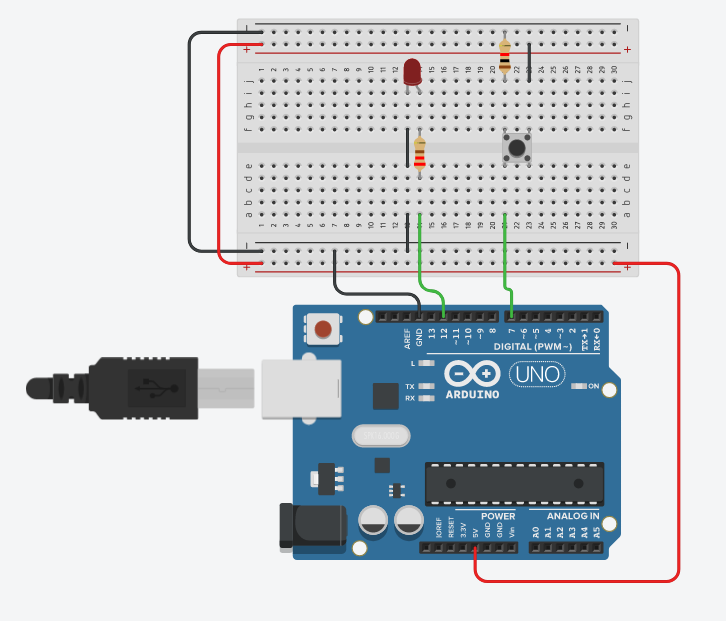
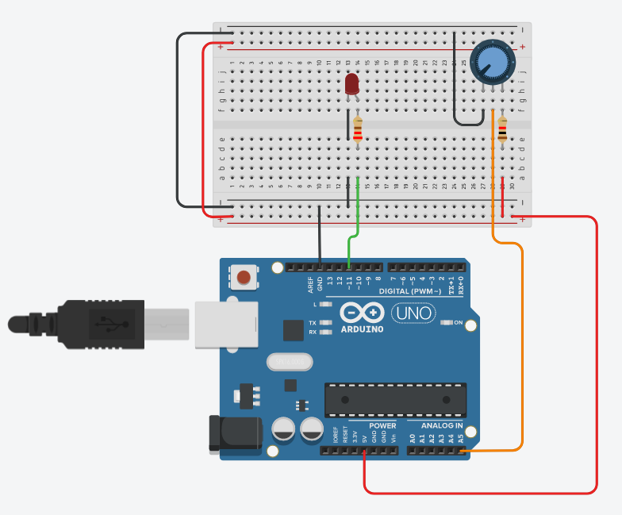
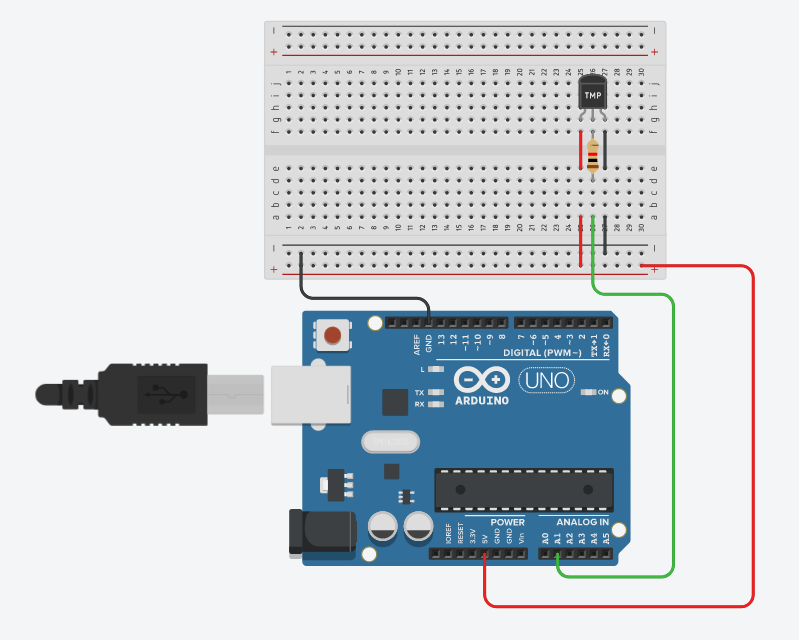
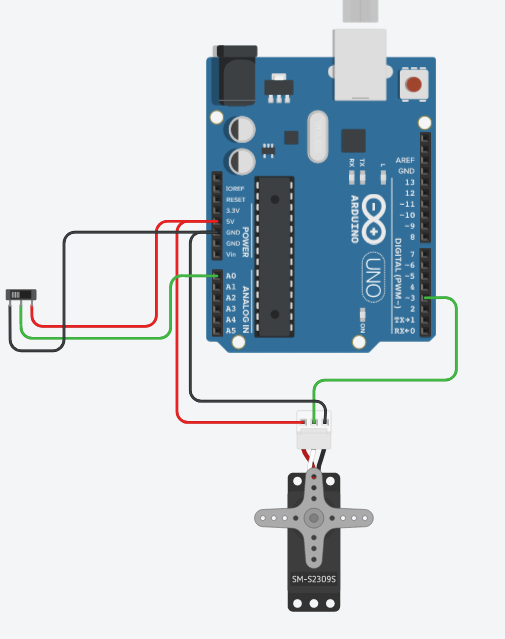

# TinkerCAD Tasks

## Blink an LED.
```
void setup() {
  pinMode(11, OUTPUT);
}

void loop() {
  digitalWrite(11, 1);
  delay(1000);
  digitalWrite(11, 0);
  delay(1000); 
}
```


## Control an LED with a pushbutton.
```
void setup() {
  pinMode(7, INPUT);
  pinMode(12, OUTPUT);
}

void loop() {
  if (digitalRead(7) == 1) {
    digitalWrite(12, HIGH);
  } else {
    digitalWrite(12, LOW);
  }
  delay(10);
}
```


## Control an LED with a potentiometer.
```
int i;

void setup() {
  pinMode(A5, INPUT);
  pinMode(11, OUTPUT);
}

void loop() {
  i = map(analogRead(A5), 0, 1023, 0, 255);
  analogWrite(11, i);
  delay(10);
}
```


## Measure temperature with a thermistor.
```
int val;
int read = 1;
double temp;
double tempf;

void setup() {
  Serial.begin(9600);
}
void loop() {
  val = analogRead(read);
  temp = (double)val / 1024;
  temp = temp * 5;
  temp = temp - 0.5;
  temp = temp * 100;
  Serial.print("TEMPRATURE (C) = ");
  Serial.print(temp);
  Serial.print("*C");
  Serial.println();
  tempf = (9/5)*temp + 32;
  Serial.print("TEMPRATURE (F) = ");
  Serial.print(tempf);
  Serial.print("*F");
  Serial.println();
  delay(1000);
}
```


## Control a servo motor(PWM).
```
#include<Servo.h>
Servo MyServo;
int pos;
int a;
void setup() {
MyServo.attach(3);
pinMode(A0, INPUT);
}

void loop() {
  MyServo.write(map(analogRead(A0), 0, 1023, 0, 180));
  delay(15);
}
```

